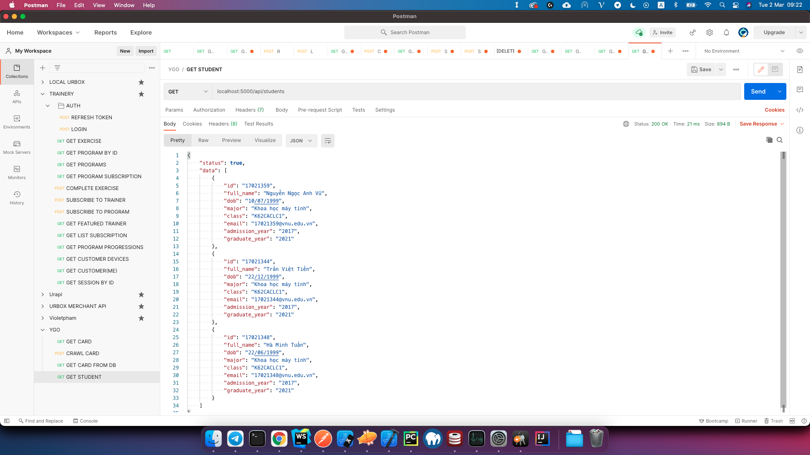
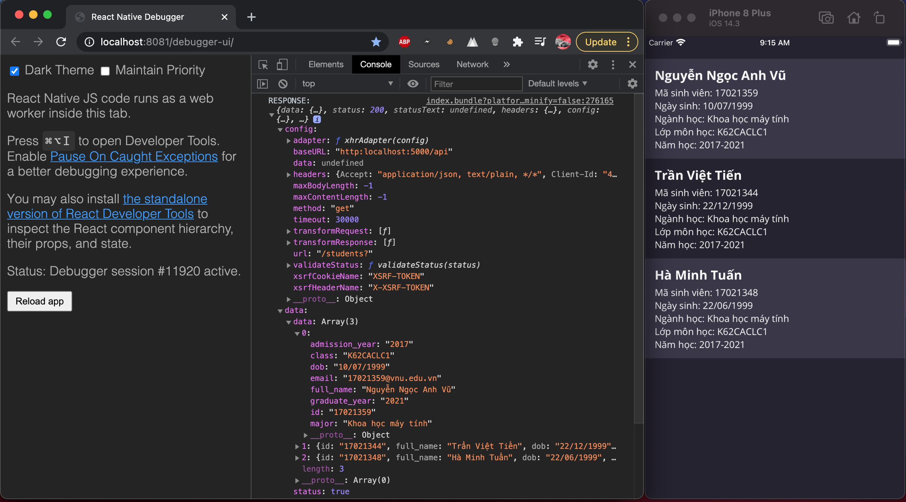

# Service Oriented Architecture Course Assignments

### Project này được tạo ra cho môn học Kiến trúc hướng dịch vụ (INT3505_20)

##Nhóm bao gồm:

- Nguyễn Ngọc Anh Vũ
- Trần Việt Tiến
- Hà Minh Tuấn

## Mục lục:

- [Tuần 1: Java client-server](https://github.com/EagleVee/soa_assignment/src/week1)
- [Tuần 2: Java RMI](https://github.com/EagleVee/soa_assignment/src/week2_rmi)
- [Tuần 3: RESTful API](src)

## Github:

- https://github.com/EagleVee/soa_assignment
- https://github.com/EagleVee/ygoapi

## Cách chạy chương trình tuần 3

- Chạy `yarn install` hoặc `npm install`
- Chạy `yarn start` hoặc `npm start`

## Kết quả của chương trình tuần 3

- API chạy trong Postman:

- Ứng dụng mobile, sử dụng React Native và Axios để request API:

- Ứng dụng web, sử dụng HTML và JavaScript để request API:
