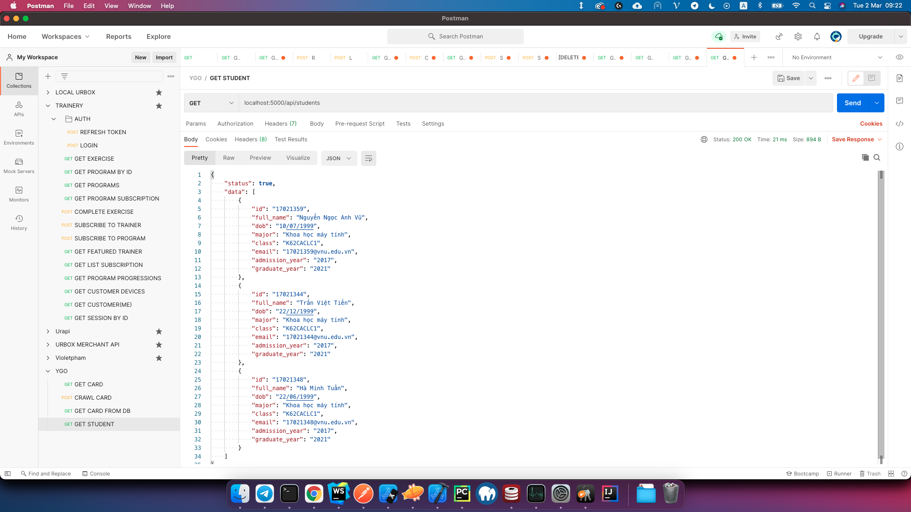
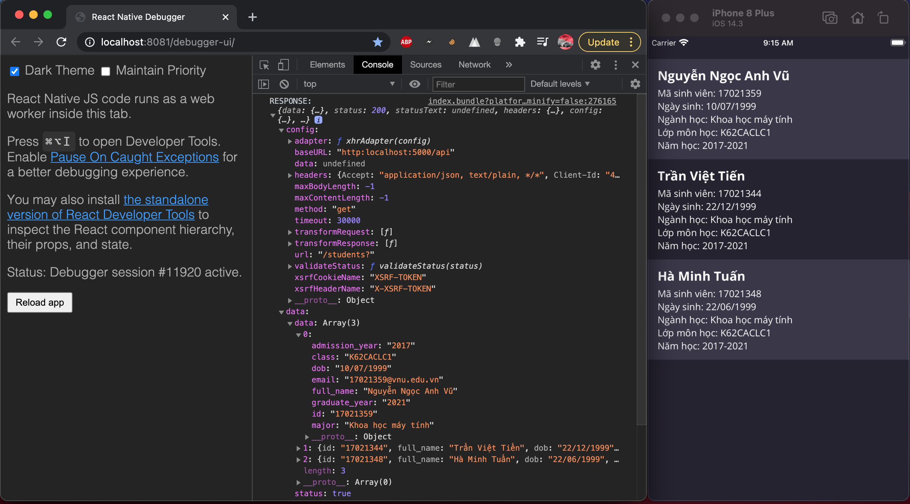
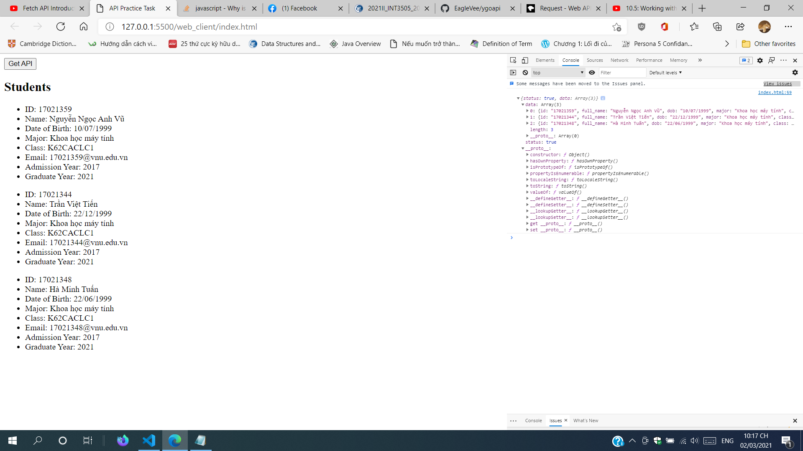

## Cách chạy chương trình tuần 3

- Chạy `yarn install` hoặc `npm install`.
- Chạy `yarn start` hoặc `npm start`.
- Kiểm tra: Mở file [index.html](web_client/index.html) bằng trình duyệt.

## Kết quả của chương trình tuần 3

- API chạy trong Postman:

- Ứng dụng mobile, sử dụng React Native và Axios để request API:

- Ứng dụng web, sử dụng HTML và JavaScript để request API:

