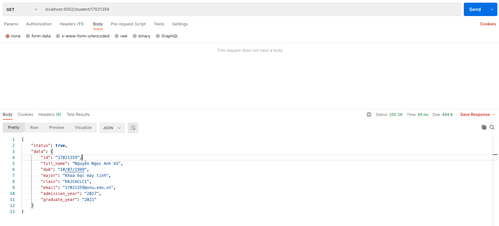

## Cách chạy chương trình tuần 4

- Chạy `yarn install` hoặc `npm install`.
- Chạy `yarn start:rpc-server` hoặc `npm start:grpc-server`.
- Chạy `yarn start:rpc-client` hoặc `npm start:grpc-client` trên một terminal khác.
- Kiểm tra: Mở trình duyệt, đi đến `localhost:5002/student/17021359`.

## Kết quả của chương trình tuần 4

- API chạy trong Postman:

